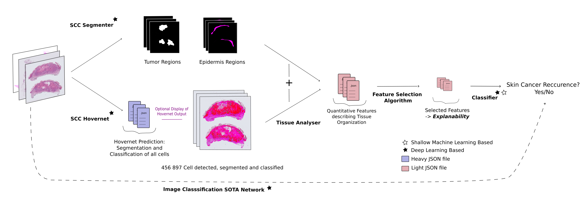

# Histo-Miner: Tissue Features Extraction With Deep Learning from H&E Images of Squameous Cell Carcinoma Skin Cancer

## Important notes

**The README will be comprehensive when the corresponding paper presenting histo-miner will be available on arxiv. So far the README is not complete.** 


<div align="center">

[Histo-Miner presentation](#presentation-of-the-pipeline) • [Histo-Miner visualization](#vizualization) • [Installation](#installation) • [Project Structure](#project-structure) • [Usage](#usage) • [Examples](#examples) • [Roadmap](#roadmap) 

</div>


## Presentation of the pipeline

<p align="center">
  
</p>


Histo-Miner employs convolutional neural networks and vision transformers models for nucleus segmentation and classification as well as tumor region segmentation. From these
predictions, it generates a compact feature vector summarizing tissue morphology and cellular interactions. We used such generated features to classify cSCC patient response to immunotherapy. 


## Project structure 

Here is an explanation of the project structure:

```bash
├── checkpoints                           # README defining where to find our models checkpoints in Zenodo
├── configs                               # All configs file with explanations
│   ├── models                            # example configs for both models inference
│   ├── classification_training           # Configs for classifier training 
│   ├── histo_miner_pipeline              # Configs for the core code of histo-minerent
├── datasets                              # README defining where to find our datasets in Zenodo
├── docs                                  # Documentation files (in addition to this main README.md)
├── scripts                               # Main code for users to run Histo-Miner 
├── src                                   # Functions used for scripts
│   ├── histo-miner                       # All functions from the core code (everything except deep learning)
│   ├── models                            # Submodules of models for inference and training
│   │   ├── hover-net                     # hover net submodule, simplification of original code to fit histo-miner needs
│   │   ├── mmsegmentation                # segmenter submodule, simplification of original code to fit histo-miner needs
├── vizualization                         # Both python and groovy scripts to either reproduce paper figures or to vizualize model inference with qupath   

```

## Vizualization

## Installation

## Usage

## Examples 

## Roadmap

