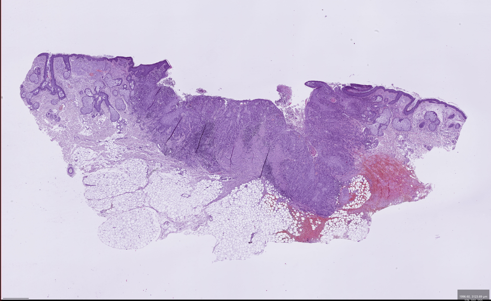
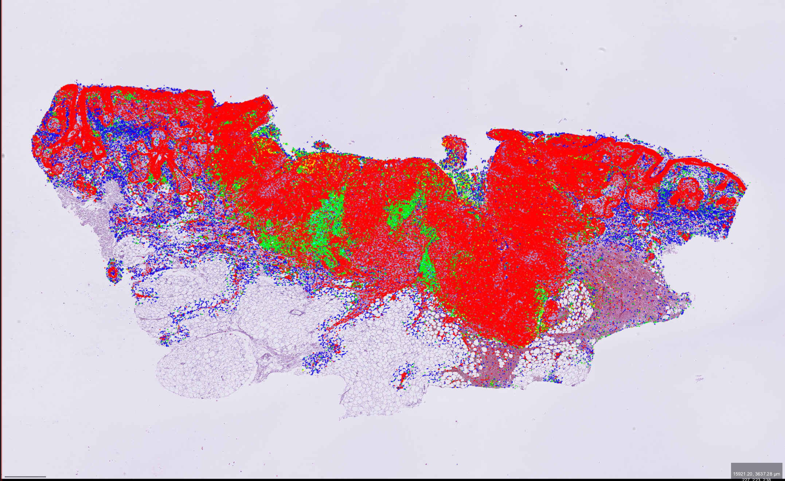
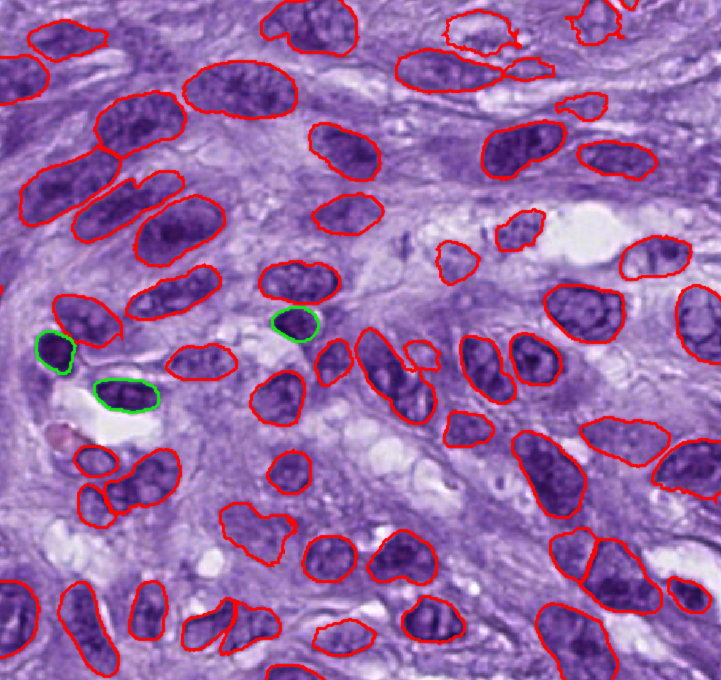

# Histo-Miner Pipeline Example


Here we will see how to use Histo-Miner on a provided WSI slide. It is similar to the **Usage** section of the README except that we will run the code together, step by step, on the same example. 


## Table of contents

- [Prerequisite](#prerequisite)
- [Set up the example](#set-up-the-example)
- [Models inference: nucleus segmentation and classification](#models-inference-nucleus-segmentation-and-classification)
- [Models inference visualization](#models-inference-visualization)
- [Tissue Analyser](#tissue-analyser)
- [Unset example](#unset-example)
- [Downstream Analyses](#downstream-analyses)


## Prerequisite

- The user is running the code on MAC or Linux OS or on Windows Subsystem for Linux (WSL) if the user is under Windows OS. 
- `histo-miner-env`, `hovernet_submodule` and `mmsegmentation_submodule` conda environment are installed as described in **Installation** section. 
- GPU compatible with CUDA


## Set up the example

These steps are specific to the example. For regular use, they are not needed. 


- Download the example slide [here](https://uni-koeln.sciebo.de/s/m7Ko2UyL6Qo4bdM)
- Open a terminal in the **histo-miner folder** and run: 

```bash
mkdir ./example/data/  
```

- Put the example slide inside that `/data/` folder 
- Now we have to set all the scripts to load the example-configs files instead of the main configs. Also, we will add the current path to the example-configs parameters. These changes will be the only difference with running the code for regular use (outside example case). Run:

```bash
conda activate histo-miner-env
cd example
python setup_example.py
cd .. 
```

It is important to run the script from the example folder. Also don't forget to run the `unset_example.py` script once you are fully done with the example!


## Models inference: nucleus segmentation and classification


Our config files are already written so lets put all the files we will need accordingly. Don't forget that we are still using the same terminal and still inside **histo-miner folder**. 

1. Download SCC Segmenter and SCC Hovernet trained weights ([SCC Hovernet and SCC Segmenter models weights](https://doi.org/10.5281/zenodo.13970198)). Then run:
```bash
mkdir ./example/checkpoints/  
```
Put all the checkpoints inside that `\checkpoint\` folder.

2.  Create folders that we will need to run inference:
```bash
mkdir ./example/results/
mkdir ./example/results/scchovernet_output/
mkdir ./example/results/sccsegmenter_output/
mkdir ./example/results/post-processing/
mkdir ./example/downsampling/
mkdir ./example/cache/
```

3. Run both inference:
```bash
cd scripts
source main1_hovernet_inference.sh
source main2_segmenter_inference.sh
cd ..
```

4. Copy the .json and .png output (inside `scchovernet_output` and `sccsegmenter_output`) inside `post-processing` folder

5. Run post-processing to correct tumor nuclei classification and reformat files for visualization: 
```bash
conda activate histo-miner-env
python scripts/main3_inferences_postproc.py
```

**Output**: One JSON file with segmented and classified nuclei for each input WSI.


## Models inference visualization 

Visualize the inference in QuPath.

1. We will create a symbolic link to the json output inside the data folder to have the original WSI and the inference in the same folder (we are still on the repository foolder):
```bash
ln -s ./example/results/post-processing/wsi_example.json   ./example/data/wsi_example.json
```
_Note: If you work from a remote cluster and want to visualize from your local machine, do not create such a symbolic link but copy paste the post-processing json file in the data folder directly_

2. Open QuPath and open the input WSI inside QuPath. To download QuPath go to: [QuPath website](https://qupath.github.io/).

3. In QuPath:
   - Go to the `Automate` menu → `Script Editor`
   - Load and run the script:
     ```bash
     visualization/qupath_scripts/open_annotations_SCC_Classes.groovy
     ```

4. (Optional) Run the conversion script:
   ```bash
   convert_annotation_to_detection.groovy
   ```
   This helps improve navigation as detection objects are lighter than annotation objects in QuPath.


**Output** The visualization on the slide:

Original slide (left side) without prediction:


<p align="center">
  
</p>


With the predictions:


<p align="center">
  
</p>


Zoomed on cells:

<p align="center">
  
</p>


## Tissue Analyser 

This step computes tissue-relevant features based on previously obtained nucleus segmentations. 

All the steps before should be done (models inference visualization is only optional).

1.  Create folders for tissue analyser output:
```bash
mkdir ./example/results/tissue_analyser/
```

2. Run:
```bash
conda activate histo-miner-env
python scripts/main4_tissue_analyser.py
```

**Output**: Structured JSON files with the computed features in the results folder. The distance calculation was skipped but can be activated in the example-config. 


## Unset example

This step is needed if you want to go back using histo-miner from the main folder. Indeed, setting the example changed the pointing of configs to `example/example-configs` instead of the regular use  `configs`. To restablished the original pointing run:
```bash
conda activate histo-miner-env
cd example
python unset_example.py
cd .. 
```


## Downstream Analyses

Now that you got the features vector for the WSI, you can use it for different downstream analyses, such as WSI classification with intrepretability, WSI self-supervised learning, WSI metadata exploration and so on. 

- In the [paper](https://www.arxiv.org/abs/2505.04672) we used these vectors to perform  classification of cSCC response to immunotherapy and described which features are the most important for the classification using feature selection, 


<p align="center">
  
</p>

<div align="center">
<b>Fig. 4: Histo-Miner tested in a clinical scenario: prediction of CPI
treatment response.</b> <sub><b>(a)</b> To test the clinical utility of Histo-Miner we assembled and
processed WSIs from in total n=45 cSCC patients before checkpoint inhibition (CPI) therapy.
<b>(b)</b> Mean ROC curve for the classifier keeping 19 best features and its standard error. The
classifier cross-validation folds ROC curves as well as the standard deviation of the mean
ROC curve are shown in Supplementary Fig. 5. <b>(c)</b> On the left, box plots of the 4 best
features, p-value was calculated using Mann-Whitney U test. On the right, visualization of
representative cases for each of the best features. For distance visualization we hide cell
classes other than plasma cells and granulocytes.</sub>
</div>


<br>
<br>


- You can run the classification with your own dataset following the **Usage** section ( _Classification of cSCC response to immunotherapy with pre-defined feature selection_ ) of the main README,


- To reproduce results from the paper, you can download CPI dataset and apply the **Usage** section ( _Classification of cSCC response to immunotherapy with pre-defined feature selection_ ) of the main README to this dataset. CPI dataset is/will be available publicly only after publication of the paper (contrary to the other datasets of this repository).


