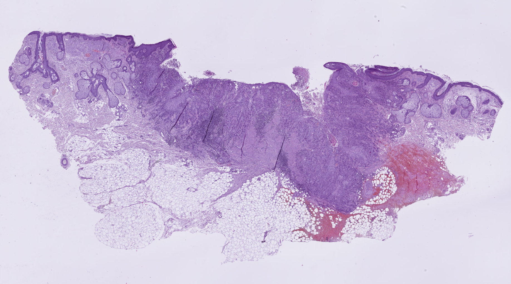
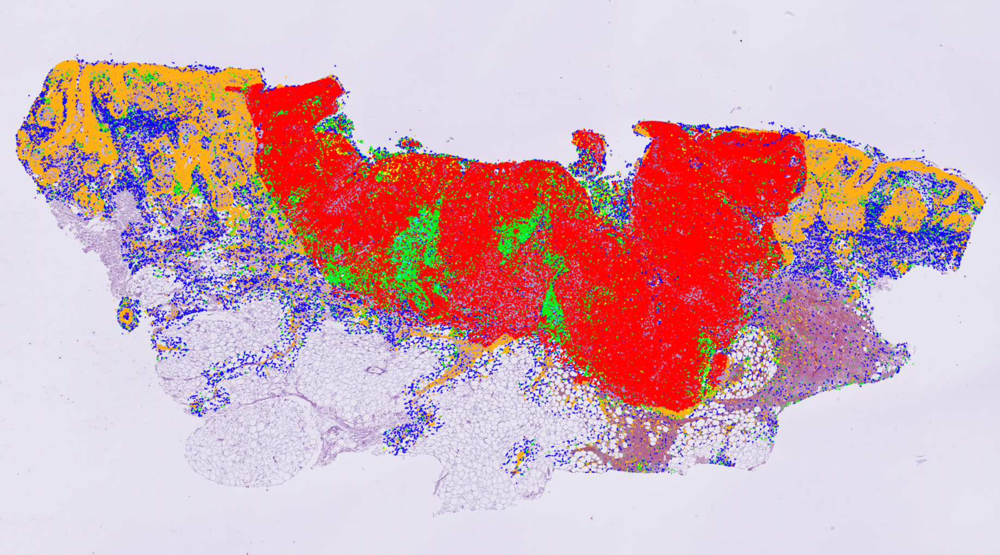

# Histo-Miner Pipeline Example


Here we will see how to use Histo-Miner on a provided WSI slide. It is similar to the **Usage** section of the README except that we will run the code together, step by step, on the same example. 


## Table of contents


## Prerequisite

- The user is running the code on MAC or Linux OS or on Windows Subsystem for Linux (WSL) if the user is under Windows OS. 
- `histo-miner-env`, `hovernet_submodule` and `mmsegmentation_submodule` conda environment are installed as described in **Installation** section. 
- GPU compatible with CUDA


## Set up the example

These steps are specific to the example. For regular use, they are not needed. 


- Download the example slide [here](https://uni-koeln.sciebo.de/s/m7Ko2UyL6Qo4bdM)
- Open a terminal in the **histo-miner folder** and run: 

```bash
mkdir ./example/data/  
```

- Put the example slide inside that `/data/` folder 
- Now we have to set all the scripts to load the example-configs files instead of the main configs. Also, we will add the current path to the example-configs parameters. These changes will be the only difference with running the code for regular use (outside example case). Run:

```bash
conda activate histo-miner-env
cd example
python setup_example.py
cd .. 
```

It is important to run the script from the example folder. Also don't forget to run the `unset_example.py` script once you are fully done with the example!


## Models inference: nucleus segmentation and classification


Our config files are already written so lets put all the files we will need accordingly. Don't forget that we are still using the same terminal and still inside **histo-miner folder**. 

1. Download SCC Segmenter and SCC Hovernet trained weights ([SCC Hovernet and SCC Segmenter models weights](https://doi.org/10.5281/zenodo.13970198)). Then run:
```bash
mkdir ./example/checkpoints/  
```
Put all the checkpoints inside that `\checkpoint\` folder.

2.  Create folders that we will need to run inference:
```bash
mkdir ./example/results/
mkdir ./example/results/scchovernet_output/
mkdir ./example/results/sccsegmenter_output/
mkdir ./example/results/post-processing/
mkdir ./example/downsampling/
mkdir ./example/cache/
```

3. Run both inference:
```bash
cd scripts
source main1_hovernet_inference.sh
source main2_segmenter_inference.sh
```

4. Copy the .json and .png output (inside `scchovernet_output` and `sccsegmenter_output`) inside `post-processing` folder

5. Run post-processing to correct tumor nuclei classification and reformat files for visualization: 
```bash
conda activate histo-miner-env
python scripts/main3_inferences_postproc.py
```

**Output**: One JSON file with segmented and classified nuclei for each input WSI.


## Models inference visualization 

Visualize the inference in QuPath.

1. We will create a symbolic link to the json output inside the data folder to have the original WSI and the inference in the same folder (we are still on the repository foolder):
```bash
ln -s ./example/results/post-processing/wsi_example.json   ./example/data/wsi_example.json
```
_Note: If you work from a remote cluster and want to visualize from your local machine, do not create such a symbolic link but copy paste the json file in the data folder directly_

2. Open QuPath and open the input WSI inside QuPath. To download QuPath go to: [QuPath website](https://qupath.github.io/).

3. In QuPath:
   - Go to the `Automate` menu → `Script Editor`
   - Load and run the script:
     ```bash
     visualization/qupath_scripts/open_annotations_SCC_Classes.groovy
     ```

4. (Optional) Run the conversion script:
   ```bash
   convert_annotation_to_detection.groovy
   ```
   This helps improve navigation as detection objects are lighter than annotation objects in QuPath.


**Output** The visualization on the slide:

Original slide (left side) without prediction:


<p align="center">
  
</p>


With the predictions:


<p align="center">
  
</p>


Zoomed on cells:

<p align="center">
  
</p>


